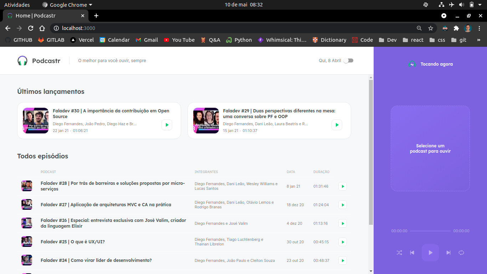
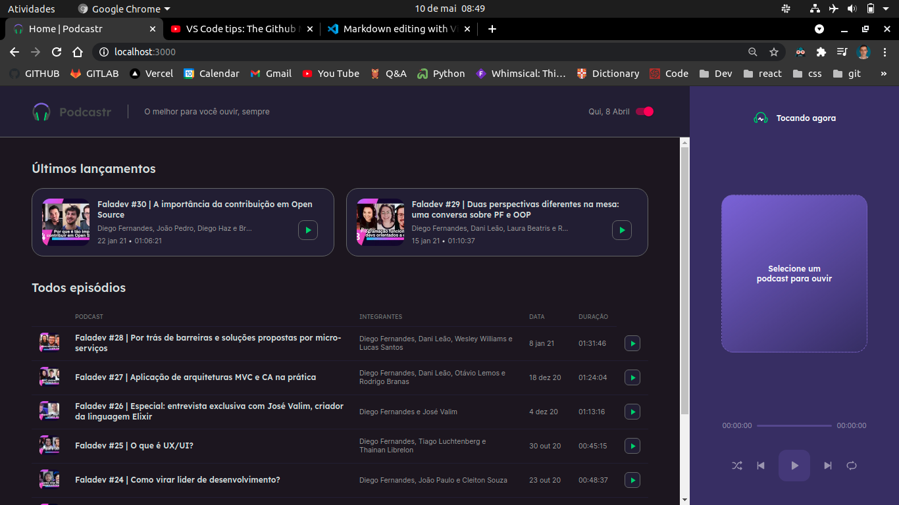

# NLW5 Missão Podcastr

Acompanhar a trilha de React.js / Next.js pela Rocketseat foi uma missão incrível, onde acompanhei o host Diego Fernandes em uma aplicação construída do zero. A proposta da nlw5 foi o projeto Podcastr, uma página que permite o usuário o acesso aos podcasts do FalaDev com features de play, pause, next áudio, loop e random.

## Iniciar Aplicação

`Yarn server`

rode esse comando no seu terminal para ativar o server na porta 3333, contendo os dados dos Podcastr FalaDev.

`Yarn Dev`
rode esse comando no seu terminal para acessar a página em modo de produção.

## Feature Extra Dark-Theme

Um dos desafios que o host Diego propos, foi a feature de thema dark, que com um switch, fosse possível trocar os temas light e dark. Aceitei a proposta com o objetivo de melhorar minhas habilidades com css/sass, e podendo aplicar a mesma técnica a outros projetos.

Dark Theme

Podcastr-dark.png

